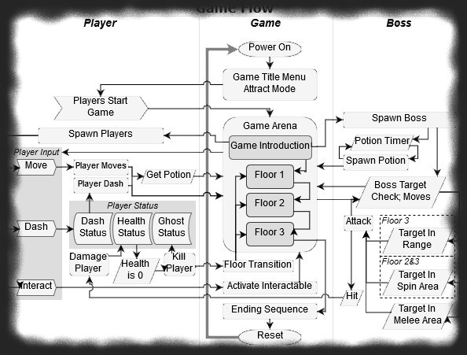
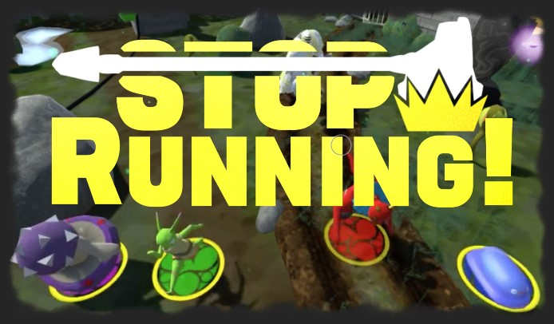
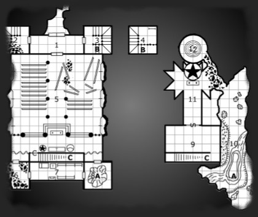
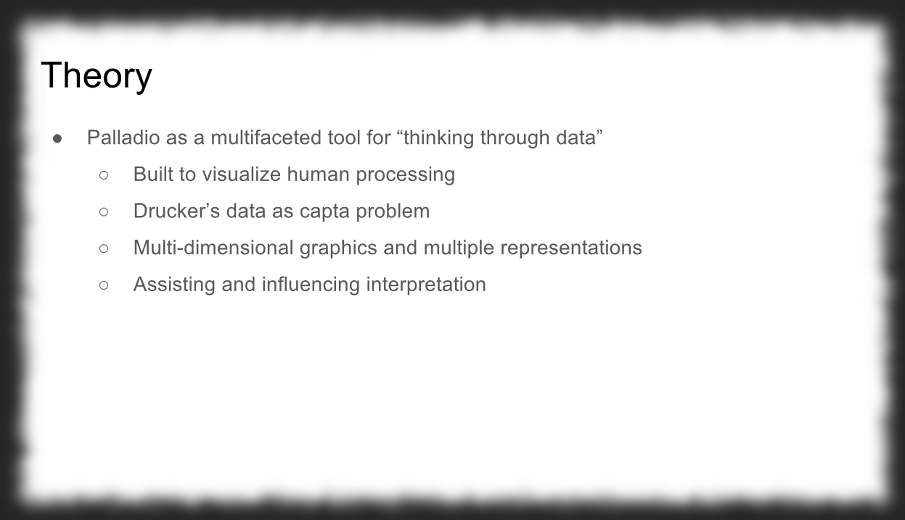

# Bio, Projects and Experience

### Bio

During my time in Interactive Arts and Sciences at Brock University my focus was always on ludonarrative construction -- how the design of an interactive work can support or change its message and experience. The way I create or improve any work is to look at the whole of a construct and how its many parts affect the final form. By extension I'd want to expand into studying the further impact interactive works have on the user and how they then affect society; again focusing on the whole but extending its reach. The goal is to follow the chain of interpretation and influence from design all the way up to culture.

My recent works demonstrate attention to structure as well as content, an application of my focus. In the analytical assignments which made up the bulk of university I tend to adopt a very critical angle. This critical focus doesn't limit itself to the content or arguements but also takes apart the language and structure of the piece itself. In university this criticism was usually limited to the work itself and did not, or could not, include the larger impacts of the texts. So, admittedly, they are not excellent examples of my wholistic approach.

My goal is to use this focus on theory and construction to design better inter-marriages of game systems and narrative. To ensure I have the tools and experience needed to guide my design I have been working on project management skills. It is important to have a realistic idea of what can be accomplished and how long, or how expensive, the project might be.

## Featured Project

## "Stop Running!"

### Winner of the LevelUp 2018 People's Choice Award

**Project Description**

This game was developed with a team of fellow fourth-year students in the Interactive Arts and Science program at Brock University. The goal was to make a game of our own design in an eight-month period. Each team member made a proposal and from those we decided what type of game to make and what features we wanted it to have. The final product is a four-player competitive game with a focus on fast-paced action and strategy. The goal of the game was kept simple: players avoid the non-player enemy character until they are the last one left. The three rounds of play each feature a unique level design with different traps and obstacles, some of which are activated by players, with points awarded depending on the order the players are knocked out.

**Role**

As a member of the Design team I was responsible for building and refining the systems within the game itself. Some of the game systems included character abilities and balance, enemy behaviour, trap/obstacle effects, the scoring system and the potion system. Design was also responsible for overall game balance and determining the flow of play in order to keep the game experience simple and fast for the players. I also assisted with asset management within the game itself and marketing design for the materials used at the LevelUp showcase.

**View ["Stop Running! by 4MonstersStudios"](https://4monstersstudios.itch.io/stop-running) on Itch.io**

## "The Temple Under The Soil"

**Purpose**
This is the result of an exercise in understanding and practicing game design. The goal was to create a short dungeon for use with the Labyrinth Lord tabletop game system (an adaptation of the original Dungeons & Dragons). After the dungeon was completed it was to be run by its creator in a short game session with other designers. Parts of the process involved random generation of certain dungeon features which I then had to work with and elaborate on.

**Process**
The first step was creating a simple map: twelve rooms that are all connected with a single entrance to the whole dungeon. I sketched out an idea I had for a crumbling temple. After I had a simple layout I added some features to make the dungeon interesting like a collapsed tower, rotting library and ambush points. Then the content of the rooms was randomly generated. Each room would have treasure, monsters, nothing or a unique feature. My results left me with several empty rooms, a few unique, two monsters and a single treasure room. With so many empty rooms I had to make sure there were enough details to keep the atmosphere and tension going so I added a lot of details and descriptions for players to look for. The unique rooms each hinted at the underlying history of the location and offered hints that clever players could use to find the treasure at the end. With only two monster rooms I made each an ambush which worked to the strengths of the monsters involved. The treasure, which I was lucky enough to get for the last room, had the only two traps in the dungeon just before it and after the last monster encounter. The goal was to punish players who were over-eager or thought the danger had passed. The overall design was refined and everyone seemed very happy playing through it.

**View ["The Temple Under The Soil"](TempleWriteup.pdf)**

## "Research Presentation"

**Abstract**  
The purpose of this work was to investigate a piece of forgotten or outmoded technology. The first part of my research was finding candidates. I relied on several gaming publications which had done articles about forgotten technology as they gave me options while allowing comparisons between them. In doing my research I happened across the Sega Channel and decided to showcase this precursor to modern game distribution networks like Steam or XBox Live. Once I had my subject I delved deeper, looking for records of older articles, publications or even advertisements which allowed me to get the whole picture. I found parallels in both function and design were apparent: the design was meant to appeal to the tastes and styles of the time, there was a selection of game demos available, a subscription gave access to playable full games and it had news about new releases on and off the Channel.

Interestingly the technology used by the device and service hadn't evolved much over time; it used the same cable-based data systems now used for broadband internet access. Despite offering a service which didn't have an equal at its time the product was discontinued after a few years as people lost interest and newer gaming systems became available. Another problem with the system could be that it was one-way communication which didn't include any ability to communicate with other players using the service itself. As a pioneer in its field the Sega Channel was worth researching to see not only the technology's evolution but how the interest of the target audience was gained or lost.

**Research Process**  
As I stated my research began far outside of academia using what could at best be considered biased secondary sources. These articles were generally small interest pieces on game-related news or magazine sites and all took the form of very casual blog posts with minimal organization. While these articles were useful to find a product to research I didn't use them for any direct information. Because it was a forgotten technology from before the internet was widely used, and its manufacturer had been merged with one of its competitors, the only primary sources available were advertisements and screen captures. Wikipedia was used to get pertinent details, like the technical specifications and dates, and compared to the advertisements to determine which information was reasonably trustworthy.

Overall I didn't receive much feedback on the presentation, or at least not much that had to change. Because of the nature of the presentation itself, and the suggestion of the instructor, the slideshow purposefully didn't have much text so the focus remained on myself and what I was saying. The slides chosen were originally just going to have single pictures but as I worked I realized adding the effects now present would help emphasize my points and hold interest. The emphasis of the presentation, and what I took away from my research, was that all technology and design has a precursor. Even though some products faila dn are forgotten present technologies and designs couldn't exist without the past attempts to build on.

**View ["A Forgotten Pioneer"](reveal/index.html)**

## "Proposal Brief" Creation and Publishing of a Desktop RPG
A full proposal and breakdown of a fictional project.

**Project Description**
This is a full project proposal created to demonstrate an understanding of project management theory and organization. I was required to create a product and then make a detailed proposal as if pitching it to prospective investors. In order to do this I had to look closely as the proposed project's scope, deliverables, risks and requirements to work out what resources would be required. Once the base needs were determined a breakdown of workflow was created, with a careful eye on task dependancies, after which a gantt chart was used to show when deliverables could be completed by. This proposal was surprisingly simple to do once everything about the project was carefully organized and accounted for. This first foray into project management served me well in later production roles.

**View ["Proposal Brief"](Proposal-Brief_Jeremy-Bone.pdf)**

## "Article Analysis" Trolling As Provocation
Understanding and presenting theories.

**Project Description**
This was a close analysis of an article relating to the act of trolling, or provoking others in an online environment, and what benefits it may actually have. The purpose of the analysis was to break down the theory so it could be presented to a group of people and explained. To this end I used a series of slides to draw attention to the main points and ideas. The challenge of this presentation was the theory itself: trying to convince the audience that the act of "trolling" could have positive effects for online cultures.

**View ["Trolling as Provocation"](https://docs.google.com/presentation/d/e/2PACX-1vTSIC0k_q0v2inm26XSX3qGGxAuHtQziAPMt1onMMyZLNv-xrehUyDo9vHRvGwcJQWWzuDuWNjvSywr/pub?start=false&loop=false&delayms=10000)**

## Collaborative Project
A brief investigation of the data analysis tool Palladio.

**Project Description**  
Done with Aaron Coomber, Kevin Pendergast and Ellen Thornton (three fellow students in the Winter 2017 course Solving Problems Through Interactive Arts & Science) this project required the creation of a presentation about the chosen data analysis tool. Palladio was chosen because of its focus on piecing together patterns from diverse or incomplete data. Using the tool we created a simple demonstration of how to link people using different pieces of personal information such as death, birth, subject or location and how the different mapping tools Palladio had available allowed different interpretations or patterns to emerge. Overall we found that the tool was useful for what it was intended, historical mapping and analysis, and as a presentation aid.

**Collaboration Statement**  
The group's approach was to look over the Palladio tool, discuss what we each observed and how it was relevant to fulfilling the assignment, divide the required information into parts and finally have each member choose one of the parts to contribute to the final slideshow and presentation. I prefer to approach collaborative work in much the same way: have each person involved contribute according to their area of knowledge. Making this work definitely requires communication both to ensure nothing is left out or forgotten and so that every collaborator can understand how their own work fits into the whole. My own contribution, the analysis and application of theory to the tool and its use, was chosen because I knew I could do the job. It was important to communicate with the others so that I had their observations and experience with the tool to build the analysis off of. The use of Google Drive helped everyone to communicate and put their contributions directly into the slideshow; as I wasn't feeling well I made sure to leave extensive notes for my slide so that the others could still present that section.

Collaboration works well with my own philosophy regarding the digital humanities. Because I try to focus on understanding the whole of a work it's very helpful to be able to see each person's knowledge and where it connects with the others. As the digital humanities themselves are cross-disciplinary and created from very different skillsets learning to collaborate on a project is very important. Such collaboration also allows me to learn from other contributors and expand my own knowledge and expertise.

[Palladio](https://docs.google.com/presentation/d/1a0jso1aSNNPia4ZIeGlJufw79F4bDrGWeB_Xh2YfusY/pub?start=false&loop=false&delayms=30000)

## Academic Blog
In which the author tries to argue that graphs shouldn't, and generally cannot, exist on their own (but can always be improved).

[Graphic Misconduct](blog.md) 
